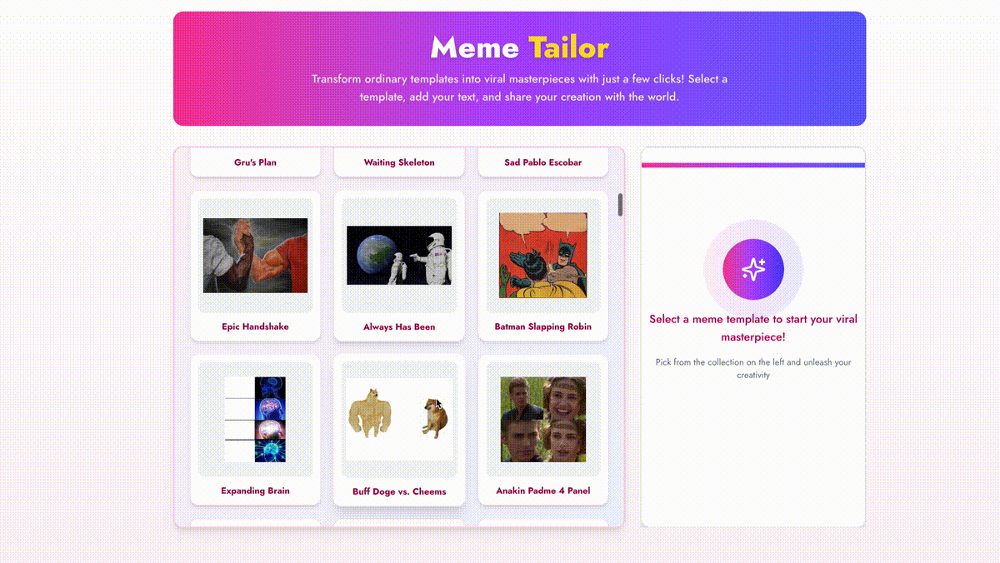

# Meme Tailor

<div align="center">
  
</div>

Meme Tailor is a modern web application that transforms ordinary meme templates into personalized memes with the help of AI. Select from popular templates, add your funny text, and watch as AI generates a custom meme for you to share.

## Features

- **AI-Powered Meme Generation**: Uses Google's Gemini AI to create custom memes
- **Template Library**: Browse and select from popular meme templates
- **Mobile-Friendly**: Responsive design with drawer component for mobile users
- **Rate Limiting**: Prevents abuse while ensuring fair usage
- **Modern UI**: Beautiful, intuitive interface with dark mode support

## Tech Stack

- **Frontend**: Next.js 15
- **Styling**: Tailwind CSS with Shadcn UI components
- **AI**: Google Generative AI (Gemini 1.5 Pro)
- **Rate Limiting**: Upstash Redis for rate limiting

## Getting Started

### Prerequisites

- Node.js 22+ installed
- Google Gemini API key
- Upstash Redis account (for rate limiting)

### Environment Setup

Create a `.env.local` file in the root directory with the following:

```
GEMINI_API_KEY=your_gemini_api_key
UPSTASH_REDIS_REST_URL=your_upstash_redis_url
UPSTASH_REDIS_REST_TOKEN=your_upstash_redis_token
```

### Installation

1. Clone the repository
2. Install dependencies:

```bash
npm install
```

3. Run the development server:

```bash
npm run dev
```

4. Open [http://localhost:3000](http://localhost:3000) in your browser

## Usage

1. Browse the meme template gallery
2. Select a template that matches your idea
3. Add your funny text in the editor
4. Click "Generate Meme" to create your masterpiece
5. Download and share your creation

## License

MIT

## Acknowledgments

- Meme templates provided by the [Imgflip API](https://imgflip.com/api)
- Built with [Next.js](https://nextjs.org) and [Shadcn UI](https://ui.shadcn.com/)
